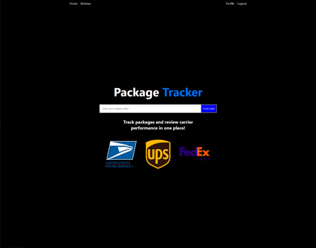
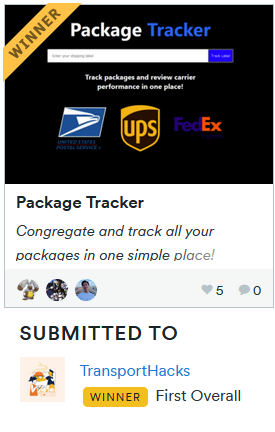

  

  <h1>Package Tracker</h1>
  A web-based application that allows users to track their packages from different shipping companies in one place, using Next.js, Tailwind, Auth0, and Firebase.
  

 

<a href="https://packagetracker.tech/">View your packages here</a>

  

      
  

  

Recently, a group mate of ours built a PC and found that it can get really annoying juggling so many different shipping labels from the many provider choices that he had had. We decided to develop a project to alleviate this and eventually settled on Package Tracker to act as a central place to congregate and track all your packages in one simple place!

We made this using Next.js as our frontend layer, and used Firebase for their Firestore database to store the labels. We used Auth0 for authentication. To ensure that labels are kept up to date, we used a Cloud Scheduler Firebase cloud function run on a cronjob.

## 🚀 Getting Started
Anybody can input their shipping labels at the home page and get an update on the current state and location of their packages. To track these, sign up and then receive a dashboard of all your labels and browse through a history of their locations and statuses. Rate and view shipping companies in terms of performance and satisfaction.

To run the project locally, follow these steps:

1. Clone the repository to your local machine.
2. Navigate to the root directory of the project.
3. Run `npm install` to install the necessary dependencies.
4. Run `npm run dev` to start the development server.
5. Visit `http://localhost:3000` in your web browser to view the application.

## 💻 Technologies

- Next.js: a JavaScript framework for building server-rendered or statically-exported applications using React.
- Firebase: A backend as a service, providing features like a document database and cloud functions.
- Mapbox: A modern solution for web mapping that provides a powerful Javascript SDK and API.
- Auth0: An authentication software as a service that provides us with a powerful sdk to add and develop authentication.
